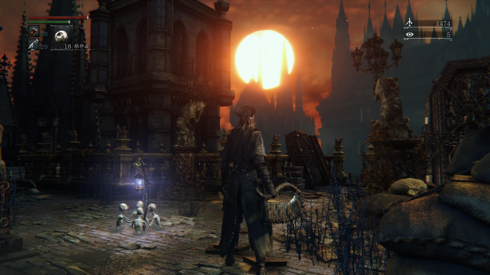

# 猎人笔记

**嘟文归档，包含了很多个人理解，如有偏差……你让让我吧！**

## 时间线

实在是对故事的时间跨度感到困惑啊，从拜伦维斯时代→劳伦斯出走→建立治愈教会→分裂出圣歌团和月之学会，期间到底过了多久，几十年或是一到两百年？

dlc的几位老猎人已经死了多久，老头还有威廉大师到底活了多久？如果老头可以在猎人梦境不死，那拜伦维斯是从森林过来的，应该与亚楠共处一个位面吧，威廉大师一直在那里，也没有什么能活得比正常人类长的能力，感觉在劳伦斯出走后最多也就活六十年？

**后补**： 

重看了一下设定集，威廉大师的形态，腿部以下像是一个吸盘，似乎是白色的粘稠触手组成的。

或许他已经不再是人了，我想他可以活得更久……一百年……两百年……都是可以的……

## 世界观

查亚楠原型的时候看到的：“血源的故事并不发生在我们所在的地球”。

游戏初期和吉尔伯特谈话，提及苍白之血，他的指引是"Across the valley to the East of Yharnam lies the town of the Healing Church, known as the Cathedral Ward." 

在亚楠以东的山谷对面，坐落着治愈教会的城镇，被称为大教堂区。“亚楠以东的山谷”指的应该是亨维克停尸房。

但是如果从亚楠中部的灯（也是吉尔伯特处）面向大教堂区（爬梯的朝向与大桥平行），夕阳出现在这个方向的左侧。对比世界地图，面向的位置大约就是亨维克停尸房。

这个位置是东方，也是太阳落下的方向。

*在Gilbert窗前就能清楚地看到夕阳的位置……这个暗示太明显了，绝对是故意的……*

## 关于我的妻子锯肉刀

锯肉刀的变形是通过机关来实现的！在长柄的顶部、靠近弯折处的位置，有一个扳机，按一下就能变形。设定集里还特意画了机关的正视图和侧视图

设计真是精巧啊，完全符合我的审美

## 关于格曼

格曼的头衔日文原文是“助言者格曼”，设定集翻译成了“进言者”，查了一下，一般译为“顾问”，按我理解其实有点“导师”的意味。英文翻译丢掉了这层意思，显得很奇怪，“我是你们猎人的朋友”，感觉就像他不是猎人一样

老头真的很老了，头发都秃了一大块，难怪帽子不离头，然而惨遭设定集开盒

才注意到格曼的右腿裤管空荡荡的，完全没有腿啊。查了一下，血液、四肢、兽化病应该有一套设定体系。老猎人裤子的描述中写：“从前的猎人认为兽化病会从右腿传播”，猎人捻血瓶也是扎右腿（做子弹是左腿吧？），许多野兽的左臂都更为巨大，“履行愿望”的结局里，坐轮椅的猎也失去了一条腿

发现其中的联系其实并不困难，兽化病是血源性疾病，左手离心脏最近，而腿部对应的应该是大动脉吧